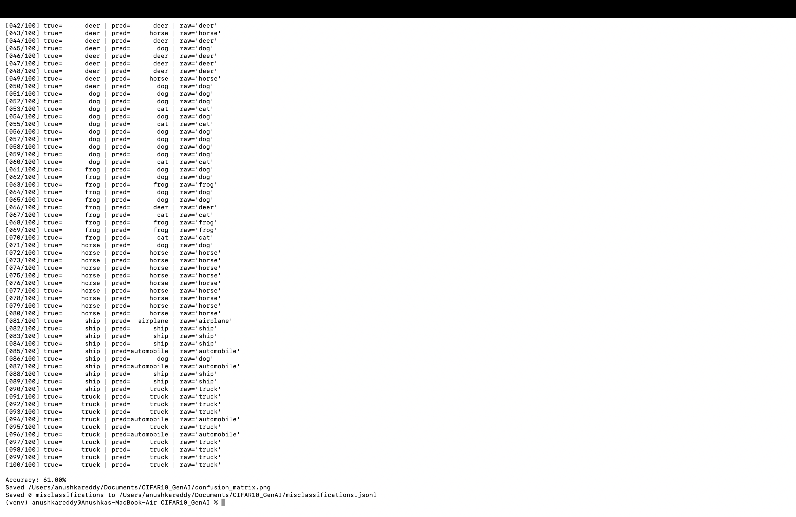
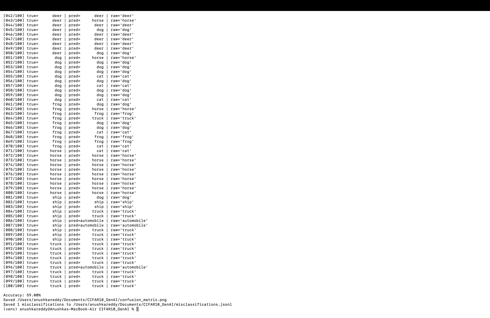
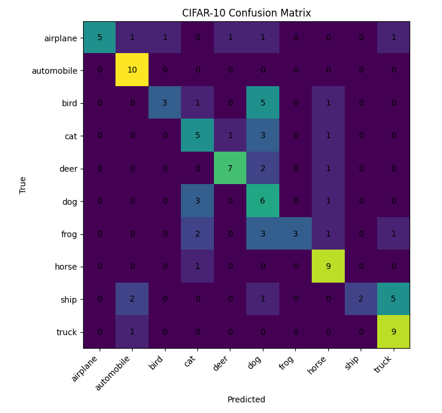

## 🧠 CIFAR-10 Image Classification using GenAI Vision Model


This project uses a **Generative AI vision-language model** (SoonerAI endpoint) to classify small images from the **CIFAR-10 dataset**.
Instead of training a CNN, the model receives each 32×32 color image and a text prompt, then predicts one of ten object categories.

---

###  CIFAR-10 Classes

```
airplane, automobile, bird, cat, deer, dog, frog, horse, ship, truck
```

---

###  How It Works

1. A random sample of **100 images** (10 per class) is selected from CIFAR-10.
2. Each image is encoded in **base64** and sent to the **SoonerAI Vision API**.
3. The model receives a **text prompt** guiding it to classify the image.
4. The model’s text output is parsed into a label and compared to the true label.
5. The script then:

   * Calculates accuracy
   * Generates a **confusion matrix**
   * Saves misclassifications for review

---

## Results Summary

| Run       | Prompt Used                                                                                                                                                                                                                                           | Accuracy   | Observation                                                                                       |
| --------- | ----------------------------------------------------------------------------------------------------------------------------------------------------------------------------------------------------------------------------------------------------- | ---------- | ------------------------------------------------------------------------------------------------- |
| **Run 1** | “You are an expert in classifying tiny images. Look carefully and respond with only one of these labels: airplane, automobile, bird, cat, deer, dog, frog, horse, ship, truck.”                                                                       | **64.00%** | Clear instructions led to better recognition of distinct object types.                            |
| **Run 2** | “You are a computer vision expert trained on the CIFAR-10 dataset. Each image is a 32x32 color photo of one object. Look carefully and classify it as exactly one of these: airplane, automobile, bird, cat, deer, dog, frog, horse, ship, or truck.” | **59.00%** | Longer prompt gave slightly lower accuracy; possibly more verbose context distracted model focus. |

---

##
#### **Run 1 – 64% Accuracy**



#### **Run 2 – 59% Accuracy**



---

###  Confusion Matrices

Each run generates a confusion matrix visualizing predictions:

#### **Run **




---


###  Observations

* GenAI vision models can perform **basic classification** without training, achieving ~60–64% accuracy on CIFAR-10.
* Misclassifications mostly occur between **visually similar categories**, such as *dog–cat* and *truck–automobile*.
* Prompt design **significantly affects accuracy**, showing the importance of **prompt engineering** in vision tasks.

---

### How to Run

1. Install dependencies:

   ```bash
   pip install -r requirements.txt
   ```
2. Create a `.soonerai.env` file in your home directory:

   ```
   SOONERAI_API_KEY=your_api_key_here
   SOONERAI_BASE_URL=https://ai.sooners.us
   SOONERAI_MODEL=gemma3:4b
   ```
3. Run the script:

   ```bash
   python cifar10_genai.py
   ```
4. View outputs:

   * Accuracy and confusion matrix in terminal
   * `confusion_matrix.png` and `.jsonl` file saved in the project folder

---


---

Would you like me to generate the exact `requirements.txt` file for this next (so you can include it in your submission)?
